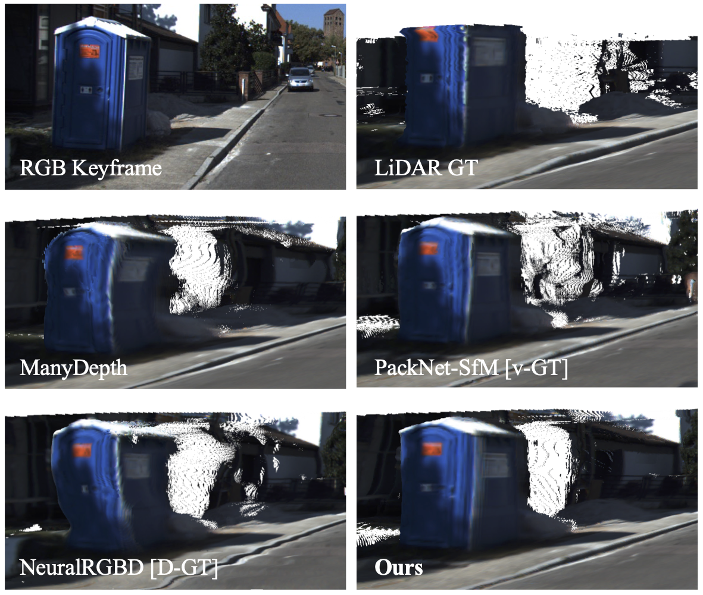
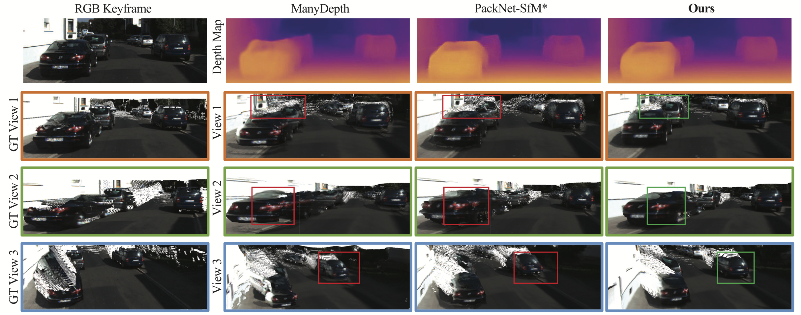
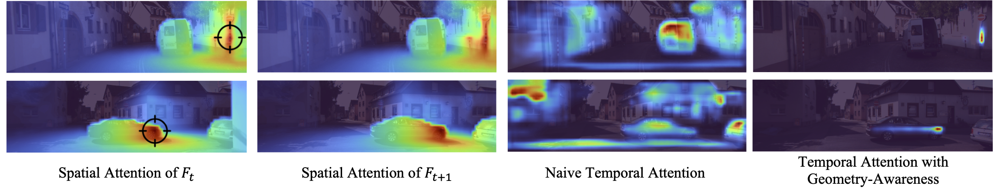
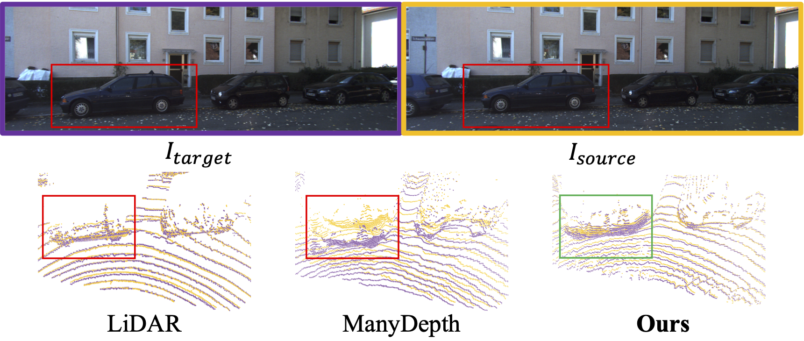

# TC-Depth
### [Project Page](https://daoyig.github.io/attention_meets_geometry/) | [arXiv](https://arxiv.org/pdf/2110.08192.pdf)  | [Workshop](https://sslad2021.github.io/files/15.pdf)


Official Repository for 
#### Attention meets Geometry: Geometry Guided Spatial-Temporal Attention for Consistent Self-Supervised Monocular Depth Estimation 
Patrick Ruhkamp*, Daoyi Gao*, Hanzhi Chen*, Nassir Navab, Benjamin Busam - 3DV, 2021.   
#### Spatial-Temporal Attention through Self-Supervised Geometric Guidance  
Patrick Ruhkamp*, Daoyi Gao*, Hanzhi Chen*, Nassir Navab, Benjamin Busam - ICCV Workshop on Self-supervised Learning for Next-Generation Industry-level Autonomous Driving, 2021. 

 \* equal contribution

<div align=center></div>  

## 🤓 TL;DR
- Current SOTA in self-supervised monocular depth estimation achievies highly **accurate** depth predictions, but suffer from **inconsistencies** across temporal frames
- Our novel **Spatial-Temporal Attention** mechanism with **Geometric Guidance** improves **consistency** while maintaining accuracy
- The **Temporal Consistency Metric (TCM)** is a quantitative measure to evaluate the consistency between temporal predictions in 3D


## 🎇 News
- [x] Release pre-trained model (02.10.2022)
- [x] Release training code (02.10.2022)
- [x] Evaluation code for TCM available (02.12.2021)

## 🖊 Results
### Qualitative Results
<p align="center">
   
</p>


### Spatial-Temporal Attention
<p align="center">
  
</p>


### Temporal Consistency Metric (TCM)
<p align="center">
  
</p>


## 💽 Resource

### GT for TCM
[3 Frames Track](https://drive.google.com/file/d/10ZzZBiY6B6wUzxwtEjwYepstFw7eAnsG/view?usp=sharing) | [5 Frames Track](https://drive.google.com/file/d/1v77HinwmssEH0HQJMjd65jCrgiZc-RaB/view?usp=sharing) | [7 Frames Track](https://drive.google.com/file/d/1XpvPfqR-vZqJmuiemJqklYy-B1yzSBb5/view?usp=sharing)  

### Pretrained Weights
[Model trained with DRNC-26 encoder](https://drive.google.com/file/d/189C9xUhwwwVgPT7qU_v5hPSw9FzivYhF/view?usp=sharing) | [Model trained with DRND-54 encoder](https://drive.google.com/file/d/1dcCtYgoPQncjb6E5JkRwYp_PGOImDwS_/view?usp=sharing)  


[//]: # (Training Procedure &#40;set default settings in ```options.py```&#41;:  )

[//]: # (```)

[//]: # (python train.py)

[//]: # (```)

[//]: # (### Pretrained Weights)

[//]: # ([KITTI DRNC-26]&#40;https://drive.google.com/file/d/189C9xUhwwwVgPT7qU_v5hPSw9FzivYhF/view?usp=sharing&#41;)

[//]: # ([KITTI DRND-54]&#40;https://drive.google.com/file/d/1dcCtYgoPQncjb6E5JkRwYp_PGOImDwS_/view?usp=sharing&#41;)

## 📄 Citation

If you find our work useful, please consider citing the following papers:

```bibtex
@inproceedings{ruhkamp2021attention,
    title = {Attention meets Geometry: Geometry Guided Spatial-Temporal Attention for Consistent Self-Supervised Monocular Depth Estimation},
    author = {Patrick Ruhkamp and
              Daoyi Geo and
              Hanzhi Chen and
              Nassir Navab and
              Benjamin Busam},
    booktitle = {IEEE International Conference on 3D Vision (3DV)},
    year = {2021},
    month = {December}
}

@article{monodepth2,
  title     = {Digging into Self-Supervised Monocular Depth Prediction},
  author    = {Cl{\'{e}}ment Godard and
               Oisin {Mac Aodha} and
               Michael Firman and
               Gabriel J. Brostow},
  booktitle = {The International Conference on Computer Vision (ICCV)},
  month = {October},
year = {2019}
}
```
## ❤ Acknowledgement
Our implementation is based on [MonoDepth2](https://github.com/nianticlabs/monodepth2) and follows their code structure. Thanks for their great contribution :) 

